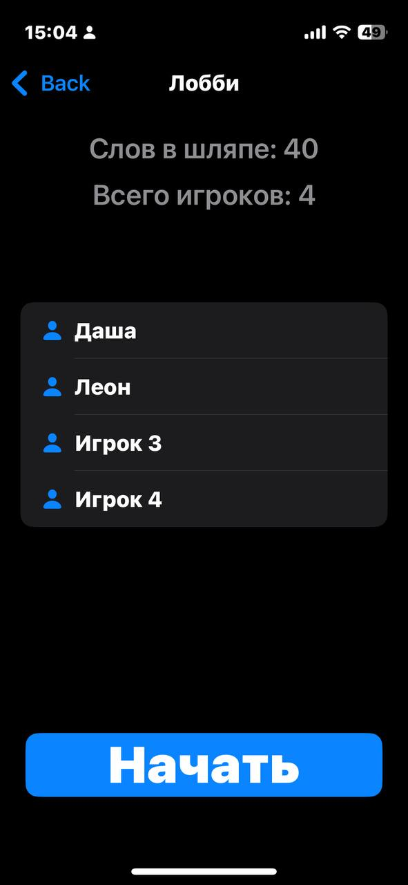
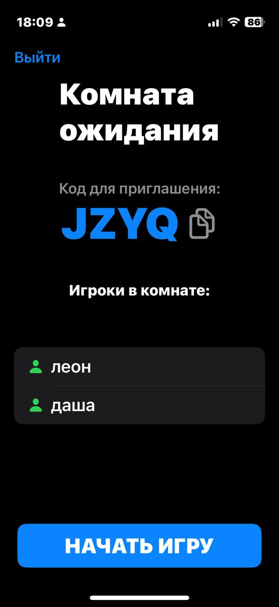
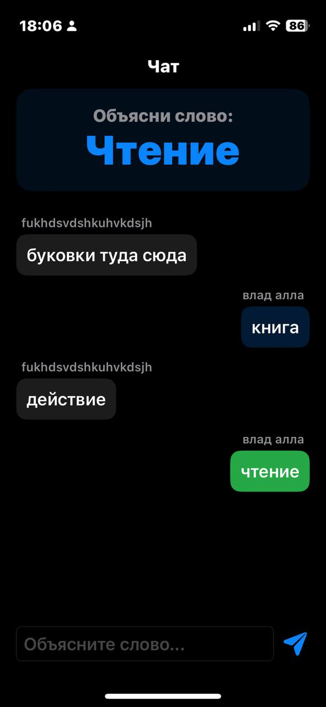

# 🎩 Шляпа

Мобильная игра **«Шляпа»** для iOS — классическая игра в слова, в которую можно играть как локально (по очереди передавая один телефон), так и онлайн с друзьями по коду комнаты.

Написано на **SwiftUI** с архитектурой **MVVM**. Онлайн-режим работает поверх собственного backend-сервера на **Swift/Vapor**.

## Содержание

- [Как играть](#как-играть)
- [Возможности](#возможности)
- [Скриншоты](#скриншоты)
- [Стек технологий](#стек-технологий)
- [Архитектура](#архитектура)
- [Backend](#backend)
- [Структура проекта](#структура-проекта)
- [Запуск проекта](#запуск-проекта)

## Как играть

Ведущий объясняет слова, а остальные игроки должны их отгадать за ограниченное время — классические правила «Шляпы, Крокодила и Элиас».

**Локальная игра** — все игроки сидят рядом и по очереди передают друг другу один телефон:
1. Настраиваете список игроков и время на ход.
2. Выбираете словарь слов (встроенный или свой собственный).
3. Игроки по очереди объясняют слова из «шляпы»: угаданное слово засчитывается в очки текущему игроку, пропущенное возвращается обратно в шляпу.
4. После того как все слова закончились — экран итоговых результатов с очками каждого игрока.

**Онлайн-игра** — каждый играет со своего устройства:
1. Один игрок создаёт комнату и получает код из 4 символов.
2. Остальные вводят имя и присоединяются по этому коду.
3. Хост запускает игру — сервер по очереди назначает игроку слово для объяснения.
4. Все игроки печатают свои варианты в общий чат; как только кто-то угадывает слово, ход автоматически завершается и переходит к следующему игроку.
5. В конце — таблица итоговых очков.

## Возможности

- 🏠 Локальный режим "hot-seat" для игры одним устройством по кругу
- 🌐 Онлайн-режим с комнатами по коду присоединения
- 📖 Встроенный словарь слов + возможность загрузить свой словарь (из файла)
- ⏱ Настраиваемое время хода и количество слов в игре
- 👥 Гибкое управление списком игроков (добавление, удаление, изменение порядка)
- 💬 Игровой чат для угадывания слов в онлайн-режиме

## Скриншоты

| Главный экран | Локальное лобби | Онлайн: комната ожидания | Онлайн: угадывание слова |
|:---:|:---:|:---:|:---:|
|  |  |  |  |

## Стек технологий

**Клиент (iOS)**
- Swift 5 / SwiftUI
- Combine (`@Published`, `ObservableObject`)
- `async/await` для сетевых запросов
- `NavigationStack` с типизированными маршрутами (`Route: Hashable`)
- `UserDefaults` / `@AppStorage` для локального хранения (кастомные словари, ID игрока)

**Backend** ([OfficeKlerk/UsersDBManager](https://github.com/OfficeKlerk/UsersDBManager))
- Swift + [Vapor 4](https://vapor.codes)
- [Fluent](https://github.com/vapor/fluent) + PostgreSQL (`FluentPostgresDriver`)
- Docker / Docker Compose для развёртывания

## Архитектура

### Клиент — MVVM

- **Models** (`Models/Models.swift`, `Models/DTOs.swift`) — доменные модели (`Player`, `Word`, `WordDictionary`) и DTO для обмена с сервером (`UserDTO`, `GameDTO`, `MessageDTO` и т.д.).
- **ViewModels**
  - `GameViewModel` — вся логика локальной игры: список игроков, словари, таймер хода, подсчёт очков.
  - `OnlineGameViewModel` — логика онлайн-игры: создание/подключение к комнате, поллинг состояния игры и чата, разбор системных сообщений, подсчёт очков.
- **Views** — экраны, разделённые на `Local/` (локальная игра) и `Online/` (онлайн-игра), плюс общие экраны (`ContentView`, `SetupPlayersView`, `DictionarySelectionView` и т.д.).
- **Network** (`Network/NetworkManager.swift`) — единственная точка обращения к REST API сервера (создание пользователей/игр, поиск игры по коду, отправка и получение сообщений).

Навигация построена на `NavigationStack` с единым перечислением `Route`, которое описывает все экраны приложения (`ContentView.swift`).

### Онлайн-режим: игра без WebSocket

Онлайн-режим не использует постоянное соединение (WebSocket/сокеты) — вместо этого клиент **поллит сервер** каждые 1.5 секунды (`OnlineGameViewModel.startPolling`), запрашивая список игроков в лобби и список сообщений игры.

Вся игровая логика реализована через **системные сообщения** (`MessageDTO` с `messageType`), которые хост и игроки пишут в общую ленту сообщений игры:

| `messageType` | Кто отправляет | Смысл |
|---|---|---|
| `sys_start_turn` | хост | назначает следующего объясняющего игрока и слово |
| `chat` | любой игрок | попытка угадать слово (или обычное сообщение в чат) |
| `sys_end_turn` | тот, кто угадал | завершает ход, засчитывает очко угадавшему |
| `sys_game_over` | хост | завершает игру |

Когда кто-то пишет в чат слово, совпадающее (без учёта регистра и «ё/е») с текущим загаданным словом, клиент угадавшего игрока сам отправляет `sys_end_turn` — сервер не занимается игровой логикой, а только хранит и отдаёт сообщения.

### Backend — слоистая архитектура Vapor

- **Controllers** — REST-эндпоинты (`UserController`, `GameController`, `GamePlayersController`, `UserMessagesController`).
- **Models** — Fluent-модели, отражающие таблицы БД (`User`, `Game`, `GamePlayer`, `UserMessage`).
- **Migrations** — миграции для создания таблиц в PostgreSQL.
- **DTO** — объекты для сериализации ответов API.

## Backend

Серверная часть (регистрация пользователей, создание игровых комнат, обмен сообщениями между игроками) вынесена в отдельный репозиторий на Swift/Vapor:

➡️ **[OfficeKlerk/UsersDBManager](https://github.com/OfficeKlerk/UsersDBManager)**

Сервер уже задеплоен, и клиент по умолчанию обращается к нему по адресу, заданному в `NetworkManager.baseURL` (см. [Network/NetworkManager.swift](Hat/Hat/Network/NetworkManager.swift)).

## Структура проекта

```
Hat/
├── Hat.xcodeproj/           # проект Xcode
└── Hat/
    ├── HatApp.swift         # точка входа приложения
    ├── DefaultWords.txt     # встроенный словарь слов по умолчанию
    ├── Assets.xcassets/     # иконка приложения, цвета
    ├── Models/
    │   ├── Models.swift     # доменные модели (Player, Word, WordDictionary)
    │   └── DTOs.swift       # DTO для общения с сервером
    ├── Network/
    │   └── NetworkManager.swift   # REST-клиент backend'а
    ├── ViewModels/
    │   ├── GameViewModel.swift        # логика локальной игры
    │   └── OnlineGameViewModel.swift  # логика онлайн-игры
    └── Views/
        ├── ContentView.swift              # главный экран и навигация
        ├── SetupPlayersView.swift         # настройка игроков и правил
        ├── DictionarySelectionView.swift  # выбор словаря
        ├── DictionaryPreviewView.swift    # предпросмотр словаря
        ├── FramedTextView.swift           # переиспользуемый UI-компонент
        ├── ResultsView.swift              # итоговые результаты (локальная игра)
        ├── Local/
        │   ├── LocalLobbyView.swift
        │   ├── GameView.swift
        │   └── TurnReviewView.swift
        └── Online/
            ├── OnlineMenuView.swift
            ├── OnlineLobbyView.swift
            ├── OnlineChatView.swift
            ├── OnlineTurnResultView.swift
            └── OnlineFinalResultsView.swift
```

## Запуск проекта

### Требования

- macOS с установленным Xcode (актуальная версия)
- iOS 17+ (проверьте фактический deployment target в настройках таргета `Hat` в Xcode)

### Шаги

1. Склонируйте репозиторий:
   ```bash
   git clone https://github.com/OfficeKlerk/Hat.git
   cd Hat
   ```
2. Откройте проект в Xcode:
   ```bash
   open Hat/Hat.xcodeproj
   ```
3. Выберите симулятор или устройство и запустите (⌘R).

Для локальной игры сервер не требуется — она полностью работает офлайн. Для онлайн-игры приложение по умолчанию обращается к уже задеплоенному серверу; если нужно поднять свой backend, разверните [OfficeKlerk/UsersDBManager](https://github.com/OfficeKlerk/UsersDBManager) (см. README этого репозитория — там же Docker Compose для локального запуска с PostgreSQL) и укажите его адрес в `baseURL` в [`NetworkManager.swift`](Hat/Hat/Network/NetworkManager.swift).
